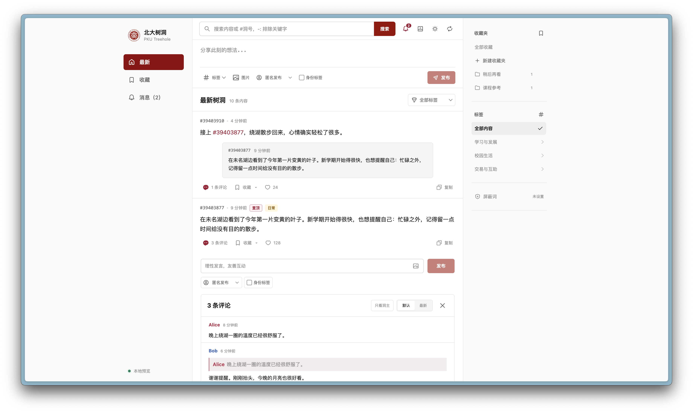
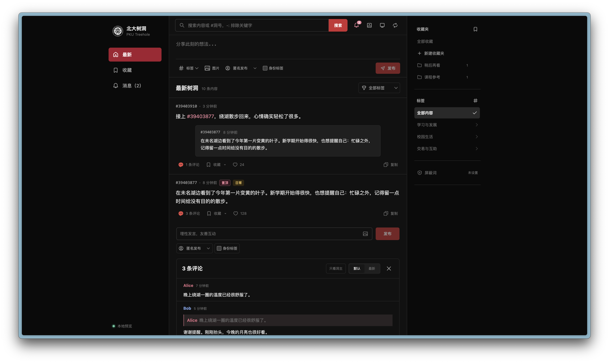
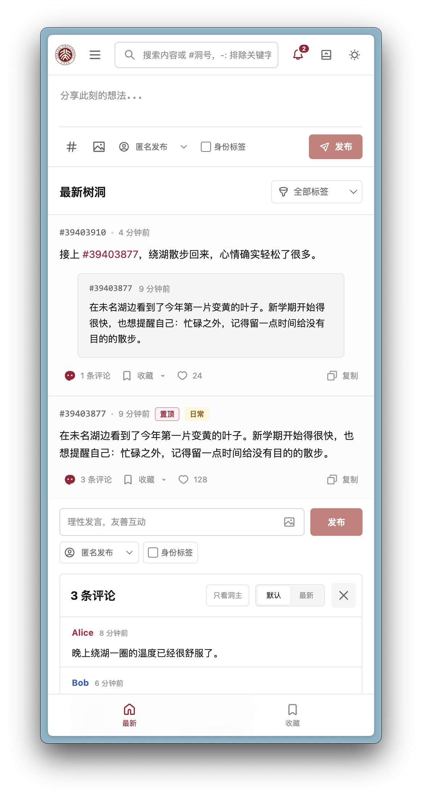
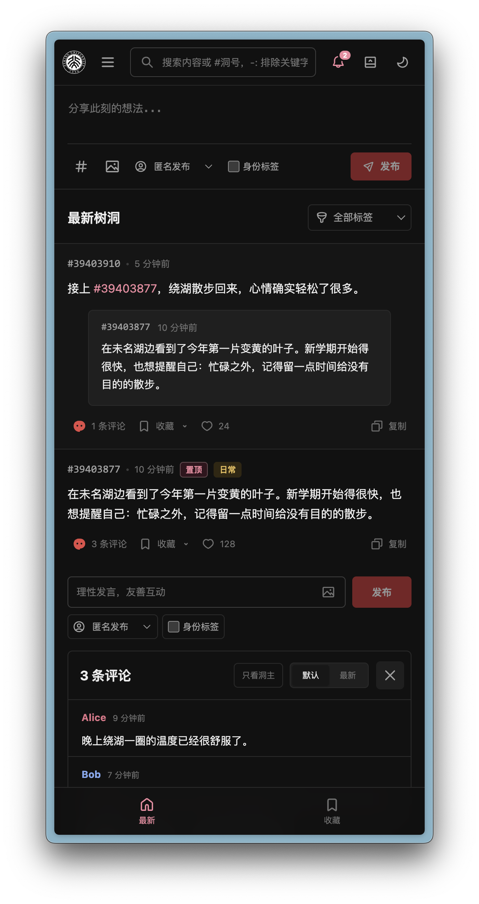

<div align="center">


# 🎨 Treehole-Art

</div>

Treehole-Art 是一款通过浏览器扩展安装的用户脚本（UserScript），使用 React + TypeScript 为北大树洞提供一套现代、简洁且支持移动端的替代界面。

它会接管 `https://treehole.pku.edu.cn/web/*` 页面，并将新版 `/ch/*` 页面重定向至旧版入口后再加载界面。登录状态仍由北大树洞提供，脚本直接复用浏览器中已有的 Cookie 与设备 UUID。

<div align="center">

[✨ 功能](#-功能) · [📦 安装](#-安装) · [🚨 使用须知](#-使用须知) · [🔎 搜索与复制](#-搜索与复制) · [🧑‍💻 贡献](#-贡献) · [🚀 发版](#-发版) · [💬 Q&A](#-qa) · [📋 LICENSE](#-license)

</div>

## ✨ 功能

### `1` 现代化界面与多端适配

- 重新设计树洞信息流、详情与评论区，适配桌面端和移动端。
- 支持浅色、深色以及跟随系统三种主题模式。
- 评论区可在居中悬浮和信息流内展开两种模式间切换，偏好会保存在当前浏览器中。









### `2` 完整的树洞浏览与互动

- 浏览最新树洞，按标签筛选，并自动加载后续内容。
- 发布文字或图片树洞、回复评论，并支持昵称与身份标签。
- 点赞、收藏与收藏夹分组管理。
- 查看互动消息、系统通知和未读数量，并支持一键全部已读。

### `3` 更方便的内容管理

- 支持关键词、洞号和排除词搜索。
- 同步树洞屏蔽词；命中的主贴与引用默认折叠，但仍可手动查看。
- 一键复制洞号、正文，或包含全部评论的完整内容。
- 点击评论用户名即可只看该用户，也可以单独筛选洞主回复。

## 📦 安装

Treehole-Art 通过用户脚本安装，支持 Chrome、Edge、Arc 与 Safari。

### 前置插件需求

#### Chrome / Edge / Arc

> [!WARNING]
> 由于 Chrome 的权限策略更新，你可能需要先在扩展管理页面打开“开发者模式”，再在 Tampermonkey 的扩展详情中启用“允许运行用户脚本”。详见 [Tampermonkey FAQ](https://www.tampermonkey.net/faq.php?locale=zh#Q209)。

请先安装浏览器扩展 [Tampermonkey](https://chrome.google.com/webstore/detail/tampermonkey/dhdgffkkebhmkfjojejmpbldmpobfkfo)，然后打开 [Treehole-Art 脚本页面](https://cdn.arthals.ink/release/Treehole-Art.user.js)，按照扩展提示完成安装。

#### Safari

请先安装 [Userscripts](https://apps.apple.com/cn/app/userscripts/id1463298887) 或 [Tampermonkey](https://apps.apple.com/cn/app/tampermonkey/id6738342400)，并在 Safari 的扩展设置中允许其访问树洞网站：

- 使用 Userscripts 时，打开 [Treehole-Art 脚本页面](https://cdn.arthals.ink/release/Treehole-Art.user.js)，再点击工具栏中的 Userscripts 图标并选择安装。
- 使用 Tampermonkey 时，打开上述脚本页面后会自动进入安装界面。

> [!IMPORTANT]
> 请在 Safari 的“编辑网站”权限中将所用扩展设为始终允许，否则 Treehole-Art 可能无法在树洞页面运行。

### 安装渠道

- [CDN for JavaScript](https://cdn.arthals.ink/release/Treehole-Art.user.js)：每次发布后自动更新。
- [GreasyFork](https://greasyfork.org/zh-CN/scripts/595878-treehole-art)：每天同步上述源一次

安装完成后，脚本会通过同一地址自动检查并获取后续更新。

## 🚨 使用须知

- Treehole-Art 是非官方第三方项目，仅修改浏览器端界面，不隶属于北京大学或北大树洞官方。
- 在真实树洞中浏览、发布或互动前，请先确保浏览器内已有有效的北大树洞登录状态。
- 脚本不会记录或导出登录 Token；请求由当前浏览器直接发送至树洞服务。所有的修改仅发生在前端客户端，并无任何对后端的侵入式处理。
- 访问新版 `/ch/*` 地址时，脚本会在页面界面逻辑运行前跳转至 `/web/`，以便接管页面。
- 若脚本影响了某项官方功能，可随时在脚本管理扩展中暂时停用 Treehole-Art，恢复原始界面。

## 🔎 搜索与复制

### 搜索语法

- 普通文字或 `#PID`：作为关键词交给树洞 API 查询；洞号搜索会同时保留原洞和引用该洞的结果。
- 多个必须包含的关键词：直接使用空格分隔。
- `-:关键词`：排除包含该词的候选结果。
- 排除短语：使用引号，例如 `-:"machine learning"`。

排除条件会在服务端返回的候选结果上继续过滤；只有排除词时，结果范围限于已经加载的候选页。

### 快速复制

- 点击树洞号，复制纯数字洞号。
- 点击卡片底部的复制按钮，选择“复制正文”或“正文和评论”。
- 桌面端可以按住 `Alt`（macOS 上也可使用 `Option`）并点击复制按钮，直接复制正文和全部评论。

## 🧑‍💻 贡献

欢迎为 Treehole-Art 贡献代码！本项目统一使用 Bun 管理依赖。

1. 安装依赖：

    ```bash
    bun install
    ```

2. 启动带 HMR 的本地演示页面：

    ```bash
    bun dev
    ```

    访问 `http://127.0.0.1:5173/`。本地预览使用内置演示数据，不会写入树洞服务。

3. 运行测试和生产构建：

    ```bash
    bun test
    bun run build
    bun run build:userscript
    ```

接口与数据结构说明参见 [API.md](./API.md)。完成修改后即可发起 Pull Request。

## 🚀 发版

维护者可以用 `bun run release` 完成测试、用户脚本构建、CDN 上传与刷新，以及 GitHub Release 发布。密钥配置、版本规则、发布演练和故障恢复参见 [RELEASE.md](./RELEASE.md)。

## 💬 Q&A

### 支持手机或平板吗？

支持。界面包含移动端导航与响应式布局；只要浏览器能够安装兼容的用户脚本扩展即可使用。

### 为什么访问新版树洞会跳回旧版地址？

Treehole-Art 目前通过旧版 `/web/` 入口承载自定义界面，因此会主动拦截 `/ch/*` 并跳转。页面内容和互动请求仍来自树洞服务。

在新版界面做类似修改存在一定冲突，图省事就直接重定向了。

### 本地开发会操作我的真实树洞账号吗？

不会。通过 `bun dev` 打开的本地页面使用项目内置的演示（Mock）数据；只有安装用户脚本并访问真实树洞域名时才会调用线上接口。

## 📋 LICENSE

Treehole-Art 基于 [GNU General Public License v3.0](./LICENSE) 开源。

Special thanks to `gpt-5.6-sol` and `codex`.